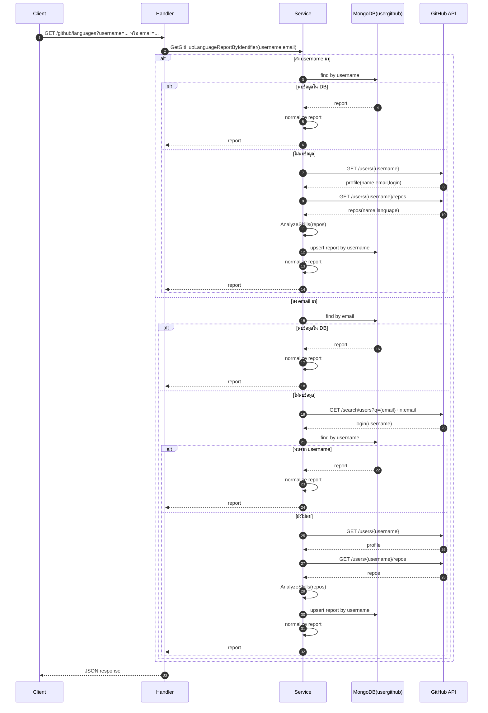

# GitHub Language Data Flow Note

เอกสารนี้อธิบายการทำงานล่าสุดของระบบดึงข้อมูลภาษาจาก GitHub โดยใช้ MongoDB เป็นแหล่งข้อมูลหลักก่อน (DB-first) แล้วค่อย fallback ไป GitHub API เมื่อยังไม่มีข้อมูล

## 1) Endpoint ที่เกี่ยวข้อง

- `GET /github/languages`
  - คืนรายงานเต็ม: `username`, `name`, `email`, `repos[]`, `languages`, `updated_at`
- `GET /github/skills`
  - คืนเฉพาะสรุปภาษา `map[string]int` (ดึงจากรายงานชุดเดียวกับ `/github/languages`)

ทั้งสอง endpoint รองรับ query 2 รูปแบบ

- `?username=<github-username>`
- `?email=<github-public-email>`

## 2) Router Layer

ไฟล์: `internal/route/route.go`

- `/github/languages` -> `handlers.GetUserLanguagesHandler`
- `/github/skills` -> `handlers.GetuserSkillHandler`

## 3) Handler Layer

ไฟล์: `internal/adapter/fiber/handlers/handler-git.go`

### 3.1 Resolve Input

ฟังก์ชัน `resolveIdentifierFromQuery` ทำหน้าที่อ่าน query

1. อ่าน `username`
2. อ่าน `email`
3. ถ้าไม่มีทั้งคู่ -> ตอบ `400 Bad Request`

### 3.2 Languages Endpoint

`GetUserLanguagesHandler`

1. ตรวจ method ต้องเป็น `GET`
2. resolve identifier จาก query
3. เรียก `service.GetGitHubLanguageReportByIdentifier(username, email)`
4. ตอบ JSON report เต็ม

### 3.3 Skills Endpoint

`GetuserSkillHandler`

1. ตรวจ method ต้องเป็น `GET`
2. resolve identifier จาก query
3. เรียก `service.GetGitHubLanguageReportByIdentifier(username, email)`
4. ตอบเฉพาะ `report.Languages`

## 4) Service Layer (DB-first)

ไฟล์: `internal/core/service/service-gitdata.go`

### 4.1 โครงข้อมูลหลัก

`GitHubLanguageReport`

- `username`
- `name`
- `email`
- `repos[]` (แต่ละ repo มี `name`, `language`)
- `languages` (สรุปจำนวนภาษา)
- `updated_at`

### 4.2 MongoDB helper

- `githubCollection()` ใช้ collection `usergithub`
- `findGitHubReportFromDB(filter)` อ่านรายงานจาก DB
- `saveGitHubReportToDB(report)` บันทึกด้วย `upsert` ตาม `username`
- `normalizeGitHubLanguageReport(report)` validate/normalize ก่อนส่งออก
  - ป้องกัน `repos` เป็น `nil`
  - ถ้าไม่มี `languages` จะคำนวณจาก `AnalyzeSkills(repos)`
  - เติม `updated_at` ถ้ายังว่าง

### 4.3 ลอจิกหลัก

`GetGitHubLanguageReportByIdentifier(username, email)`

1. ถ้ามี `username` -> ไป `GetGitHubLanguageReport(username)`
2. ถ้ามี `email` -> ลองหาใน DB ก่อนด้วย `email`
3. ถ้าไม่เจอใน DB -> resolve username จาก `ResolveGitHubUsernameByEmail(email)`
4. ไปดึง report ด้วย username และบันทึกลง DB
5. คืนข้อมูลที่ normalize แล้ว

`GetGitHubLanguageReport(username)`

1. หาใน DB ก่อนด้วย `username`
2. ถ้าไม่เจอ:
   - เรียก `FetchGitHubUser(username)` เพื่อเอา `name/email/login`
   - เรียก `FetchGitHubRepos(login)` เพื่อเอา repo ทั้งหมด
   - คำนวณ `languages` ด้วย `AnalyzeSkills(repos)`
   - บันทึกลง DB
3. คืนรายงานที่ผ่าน normalize

### 4.4 External GitHub API ที่ใช้

- Resolve จาก email:
  - `https://api.github.com/search/users?q=<email>+in:email`
- User profile:
  - `https://api.github.com/users/<username>`
- Repos:
  - `https://api.github.com/users/<username>/repos`

## 5) Error Handling

- `405 Method Not Allowed`
  - เรียก endpoint ด้วย method อื่นที่ไม่ใช่ `GET`
- `400 Bad Request`
  - ไม่ส่งทั้ง `username` และ `email`
- `500 Internal Server Error`
  - DB ไม่พร้อม, GitHub API error, decode ไม่ได้, หรือ resolve email ไม่เจอ

## 6) ตัวอย่างเรียกใช้งาน

### แบบ username

- `GET /github/languages?username=torvalds`
- `GET /github/skills?username=torvalds`

### แบบ email (ต้องเป็น public email)

- `GET /github/languages?email=public-email@example.com`
- `GET /github/skills?email=public-email@example.com`

## 7) ข้อจำกัดที่ควรรู้

- ถ้า email ไม่ได้เปิด public บน GitHub จะ resolve username ไม่ได้
- ยังไม่ได้ใส่ GitHub token อาจเจอ rate limit
- การสรุปภาษาใช้ field `language` หลักของแต่ละ repo

## 8) สรุปลำดับการทำงาน

Client -> Router -> Handler -> Service (DB-first) ->

- ถ้ามีใน MongoDB: DB -> normalize -> response
- ถ้าไม่มีใน MongoDB: GitHub API -> build report -> save MongoDB -> normalize -> response

## 9) Sequence Diagram (Mermaid)

